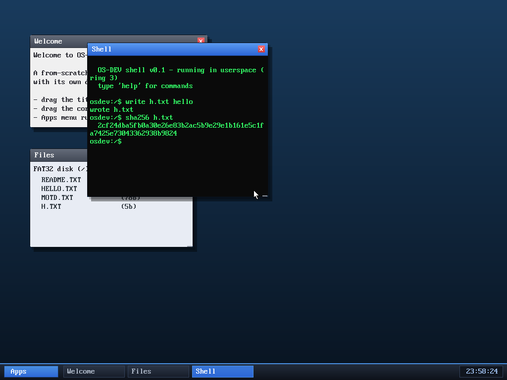

# Milestone 66 — SHA-256

**Goal:** a real cryptographic hash — SHA-256 — both as a useful file-checksum
tool and as the first building block toward HTTPS.

`write h.txt hello` then `sha256 h.txt` prints
`2cf24dba5fb0a30e26e83b2ac5b9e29e1b161e5c1fa7425e73043362938b9824` — which is
**exactly** the SHA-256 of "hello" (verified against `sha256sum`). So the
implementation is correct to the bit.

## The implementation

`kernel/sha256.c` is a textbook FIPS 180-4 SHA-256: process the message in
64-byte blocks, expand each into a 64-word message schedule, run the 64-round
compression with the standard round constants, and add the result into the
running hash. The one tidy trick is that the padding (the `0x80` byte, the zero
fill to 56 mod 64, and the 64-bit length) is **synthesized on the fly** as each
block is assembled, so it needs no buffer larger than the input.

`sha256 <file>` reads the file and prints the hex digest — genuinely handy for
checking file integrity, and the correctness is easy to trust because it matches
the reference exactly.

## Why it matters beyond checksums

SHA-256 is one of the core primitives a TLS handshake needs (for the handshake
transcript hash, HMAC, and the PRF/HKDF). HTTPS — the big gap that keeps the
browser HTTP-only — is a large subproject (it also needs a cipher, a key
exchange, and certificate parsing), but this is a correct, tested first piece of
that foundation, useful on its own today.

## Files
- `kernel/sha256.c`, `kernel/include/sha256.h` — the hash
- `kernel/syscall.c`, `user/ulib.c`, `user/shell.c` — `SYS_sha256` + the `sha256`
  command (hash a file)
