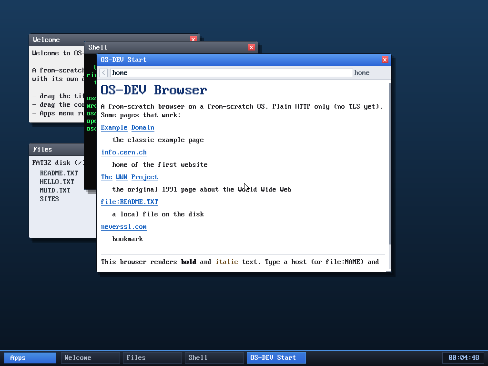

# Milestone 67 — Customizable bookmarks

**Goal:** let the user customize the browser's start page — add their own
bookmarks by editing a file on disk.

The built-in bookmarks are still there, and below them is **neverssl.com** — a
bookmark the user added with `write SITES neverssl.com` (it would work just as
well from the text editor). Edit the `SITES` file, one URL per line, and they
appear as clickable links on the home page.

## How it works

The start page used to be a fixed HTML constant. It's now **built dynamically**
(`build_home`) into the browser's scratch buffer: the built-in bookmarks, then —
if a `SITES` file exists — one `<a>` per line read from it (`vfs_read`),
prepending `http://` to bare hosts. The result is parsed by the same renderer.
So it ties three subsystems together: edit a file (FS / editor), and the browser
(home page) reflects it.

## A FAT32 gotcha worth recording

The file is called `SITES`, not `BOOKMARKS`, on purpose: the filesystem stores
**8.3 short names only**, so a 9-character name like `BOOKMARKS` is truncated to
`BOOKMARK` on write — but a lookup by the full `BOOKMARKS` compares against the
*formatted* stored name and misses. (Making the lookup normalize like the writer
would break `.`/`..` matching, which path resolution relies on, so it's left as
the documented "8.3 names only" limitation.) Using a ≤8-character name sidesteps
it entirely.

## Files
- `kernel/browser.c` — `build_home` (dynamic start page + `SITES` bookmarks)
