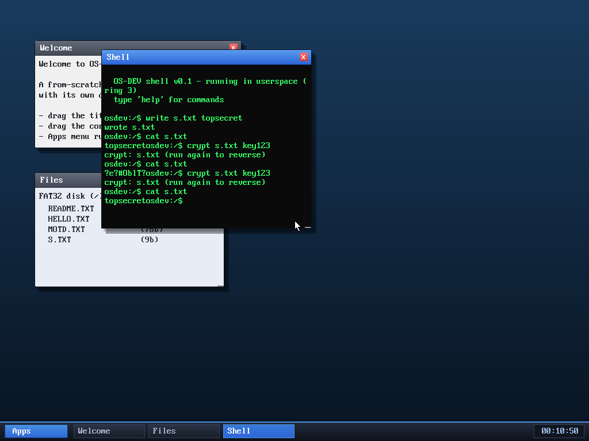

# Milestone 68 — AES-128 + file encryption

**Goal:** a real symmetric cipher — AES-128 — and a `crypt` command that
encrypts/decrypts files with a passphrase.

The session says it all: `topsecret` → `crypt s.txt key123` turns the file into
`?e?#0blT?` (ciphertext) → running `crypt` again with the same passphrase
restores `topsecret`. Real, reversible, passphrase-based file encryption.

## The cipher

`kernel/aes.c` is a textbook FIPS-197 AES-128: an initial AddRoundKey, nine
rounds of SubBytes / ShiftRows / MixColumns / AddRoundKey, and a final round
without MixColumns, over an 11-round key schedule (`xtime` does the GF(2⁸)
doubling for MixColumns). It's **verified against the FIPS-197 test vector** —
encrypting the standard input gives exactly `69c4e0d8…b4c55a`.

## Tying it together

`crypt <file> <pass>` runs AES in **CTR mode**: the cipher encrypts a counter
sequence and the result is XORed into the file, so encryption and decryption are
the *same* operation — run `crypt` twice and you're back to the original. The
16-byte key and the nonce are derived by hashing the passphrase with the SHA-256
from milestone 66 (`key = SHA256(pass)[0..16]`, `nonce = [16..32]`), so the three
crypto pieces — hash + cipher + mode — work together.

It's the first feature that's *two* from-scratch primitives composed into a
useful tool, and both are standard-correct (verified hash, verified cipher).

## Honest caveat

The nonce is derived from the passphrase, so encrypting two different files with
the same passphrase reuses the keystream — a real CTR weakness. A production tool
would use a random per-file nonce stored alongside the ciphertext. Fine for a
hobby "lock this file" tool; not for protecting real secrets.

## Files
- `kernel/aes.c`, `kernel/include/aes.h` — AES-128 + CTR
- `kernel/syscall.c`, `user/ulib.c`, `user/shell.c` — `SYS_crypt` + the `crypt`
  command (SHA-256 key derivation)
