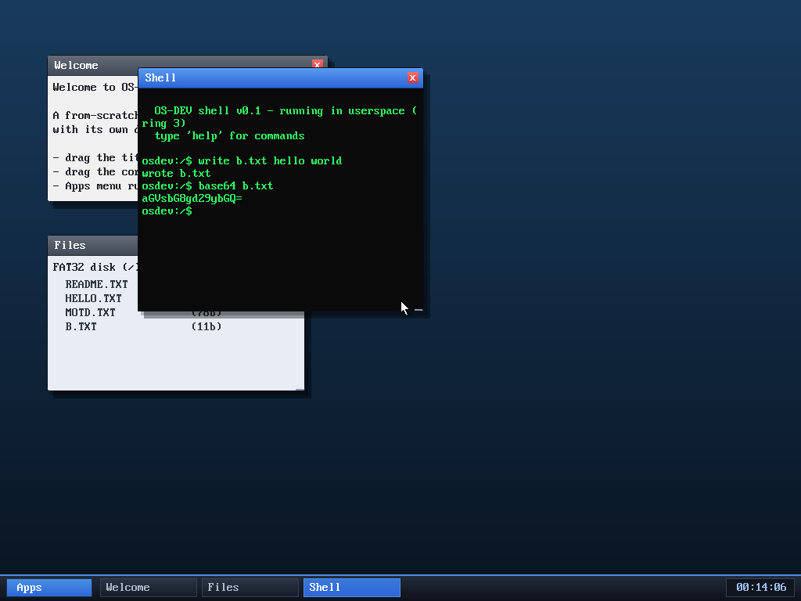

# Milestone 69 — `base64`

**Goal:** Base64 encoding — turn a file's bytes into ASCII text. Handy on its
own, and a natural partner to `crypt` (encode ciphertext into something you can
copy as text).

`base64 b.txt` (with `b.txt` = "hello world") prints `aGVsbG8gd29ybGQ=` — exactly
what the standard `base64` tool produces.

It's a small shell command: read the file, take the bytes three at a time, map
each group to four characters of the Base64 alphabet, and pad the final group
with `=`. Output is wrapped to fit the window.

This completes a tidy little crypto/encoding corner of the toolkit: **`sha256`**
(integrity), **`crypt`** (AES encryption), and **`base64`** (encoding).

## Files
- `user/shell.c` — the `base64` command
