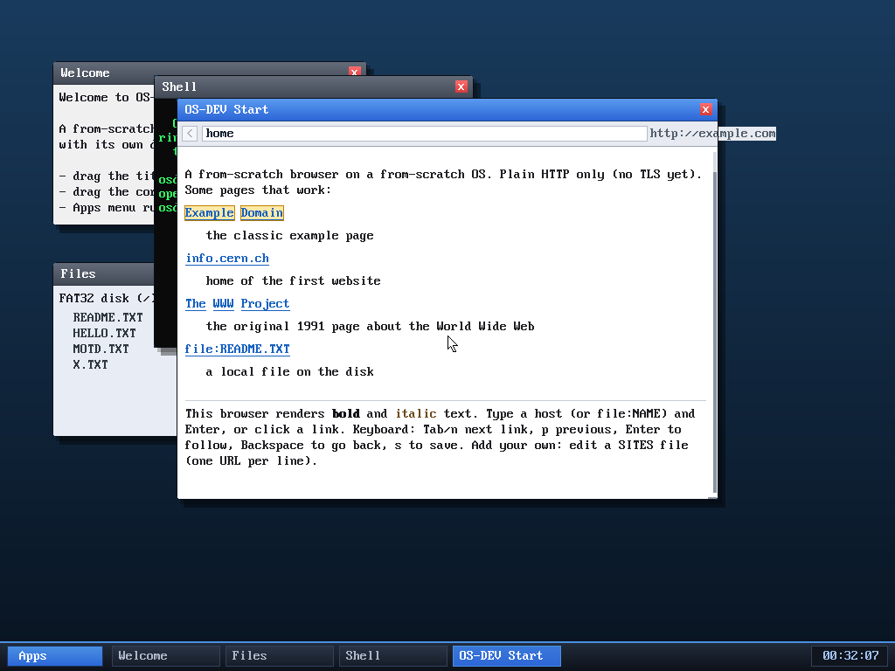
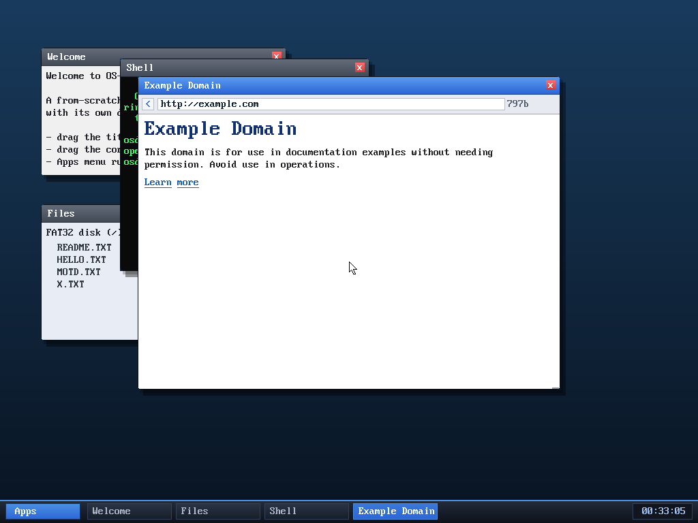

# Milestone 72 — keyboard link navigation

**Goal:** follow links with the keyboard. Until now the browser's links were
**mouse-click-only**, which meant two problems: (1) no way to browse without a
pointer, and (2) it was *untestable headlessly* — QEMU's monitor can't position
the USB tablet, so a scripted click never lands. Keyboard navigation fixes both.

## How it works

The browser already tags each rendered word with a *link id* (an index into the
page's href table). Three small additions in `kernel/browser.c`:

- **`int sel`** on the browser — the currently selected link id (`NO_LINK` when
  none). Reset to `NO_LINK` on every page load (in `parse_html`/`parse_text`).
- **`int linky[LINK_MAX]`** — during render, the content-space y of each link is
  recorded *even for off-screen links*, so selecting one can scroll it into view.
- **`select_link(b, dir)`** — moves the selection forward/back with wraparound,
  scrolls the chosen link near the top of the viewport, and shows its target URL
  in the status line so you can see where Enter will take you.

Keys (when not editing the address bar):

| key | action |
|-----|--------|
| `Tab` or `n` | select next link |
| `p` | select previous link |
| `Enter` | follow the selected link |
| `Backspace` | back (unchanged) |

The selected link gets a **highlight background + a gold outline box** in the
render loop, so it's obvious which one Enter will follow.

## Verified end-to-end (headless, by screenshot)

This is the first browser-interaction feature I could verify *without a mouse*:

1. `browse home` opens the local start page with its bookmark links.
2. `n` → **"Example Domain"** highlights, status shows `http://example.com`.
3. `n` again → selection advances to **info.cern.ch**, status `http://info.cern.ch`.
4. `Enter` → the browser **fetches example.com over the real network** and
   renders it (title bar + taskbar chip read "Example Domain", status "797b").

## Why it matters

The browser is now fully drivable from the keyboard — address bar, scrolling,
link selection, follow, back, save — no pointer required. And just as importantly,
the whole link-follow path is now scriptable in the headless test harness, so
future browser work has real regression coverage instead of "trust the click
logic."

## Files
- `kernel/browser.c` — `sel`/`linky` state, `select_link`, render highlight, key
  bindings (`Tab`/`n`/`p`/`Enter`); home-page help text updated
