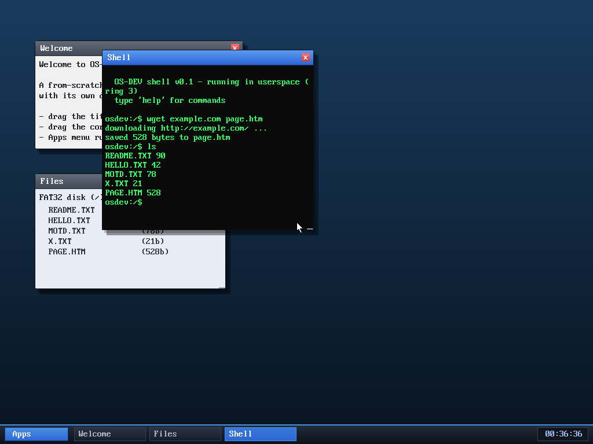

# Milestone 73 — `wget`: download from the web to disk

**Goal:** a shell command that fetches a URL and **saves the body to a file**,
composing the network stack and the filesystem into a download tool.



## What it does

```
wget <host>[/path] <outfile>
```

It parses the host (and optional path) and the output filename, fetches over the
existing `SYS_http` path (hand-rolled TCP + HTTP/1.0), strips the HTTP response
headers at the first `\r\n\r\n`, and writes just the **body** to `<outfile>` on
the FAT32 disk.

Where the browser's `s` key saves a *rendered* "reader-mode" text dump
(milestone 42), `wget` saves the **raw bytes** — so you can download an HTML
file and then `browse file:PAGE.HTM` to view it offline, `cat` it, `edit` it, or
`sha256` it. It's the shell-level counterpart to the browser save.

## Verified end-to-end

Fetched the real internet, headless:

```
osdev:/$ wget example.com page.htm
downloading http://example.com/ ...
saved 528 bytes to page.htm
osdev:/$ ls
README.TXT 90
...
PAGE.HTM 528
```

528 bytes is exactly the example.com body (the full 797-byte response minus the
HTTP headers), confirming the header strip is correct. The Files window updated
live to show `PAGE.HTM (528b)` — net → FS → desktop, all wired together.

## Files
- `user/shell.c` — the `wget` command (parse, `sys_http`, header strip,
  `sys_writefile`) + help text
