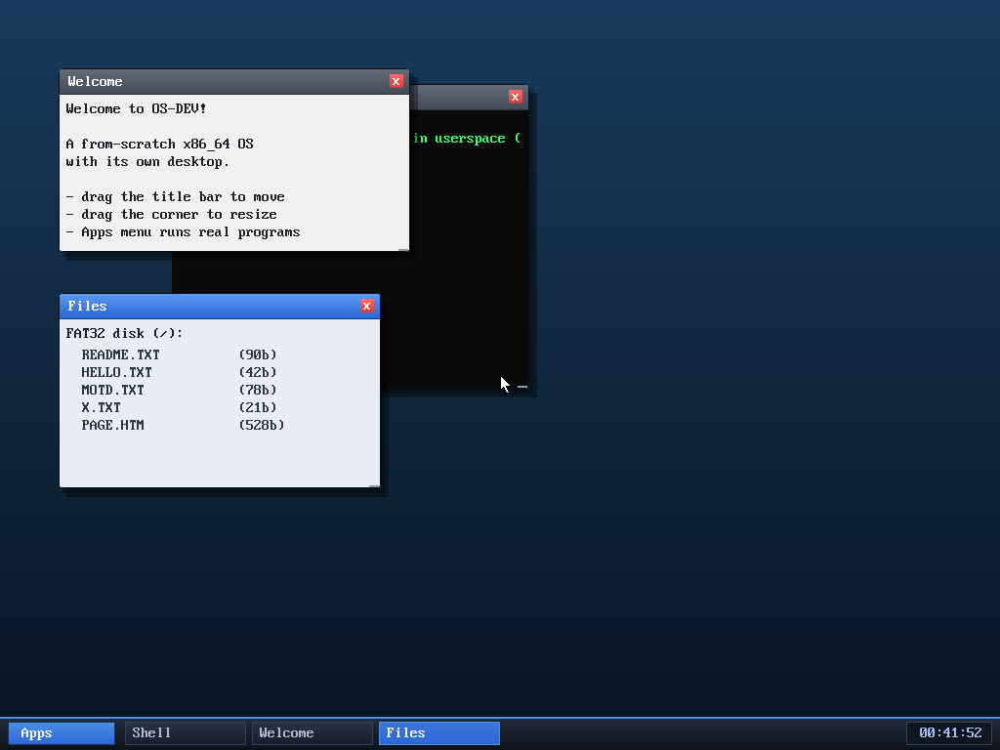

# Milestone 75 — keyboard window switching (F2)

**Goal:** switch window focus from the keyboard. Until now the focused window was
always the topmost one, and the only way to change it was a mouse click on a
window or its taskbar chip. That's a gap in the desktop *and* a headless-testing
limitation — without a mouse I could only ever drive the last-spawned window.

## How it works

Two tiny pieces:

- **`kernel/keyboard.c`** — the function keys weren't in the keymap (they were
  dropped). F2 (scancode `0x3C`) now pushes a control code `0x0E` into the shared
  input ring. `0x0E` is otherwise unused (it's not a printable char and not one
  of the arrow/Enter/Backspace control codes apps look for).
- **`kernel/desktop.c`** — the WM's input loop intercepts `0x0E` *before* routing
  keys to the focused app, and calls `raise_window(0)`.

`raise_window(0)` lifts the **bottom** window to the top. Because the previously
focused window sinks one step each press, repeated F2 presses round-robin through
*every* window and back. Intercepting the code in the WM means apps never see it,
so it can't collide with anything a program is typing.

## Verified (headless, by screenshot)

Boot focuses the Shell. Then:

1. **F2** → focus moves to **Welcome** (raised to top, Shell's title bar greys).
2. **F2** → focus moves to **Files** (raised; its taskbar chip highlights).
3. A third F2 would return to the Shell.

Each step shows the focused window with the bright-blue title bar, on top, with
its taskbar chip highlighted — confirming both the z-order raise and the focus
change.

## Why it matters

The desktop is now navigable without a pointer (a real DE convenience), and —
just as usefully — the headless test harness can now move focus between windows,
so multi-window interactions are finally scriptable.

## Files
- `kernel/keyboard.c` — F2 → control code `0x0E`
- `kernel/desktop.c` — WM intercepts `0x0E` → `raise_window(0)`
