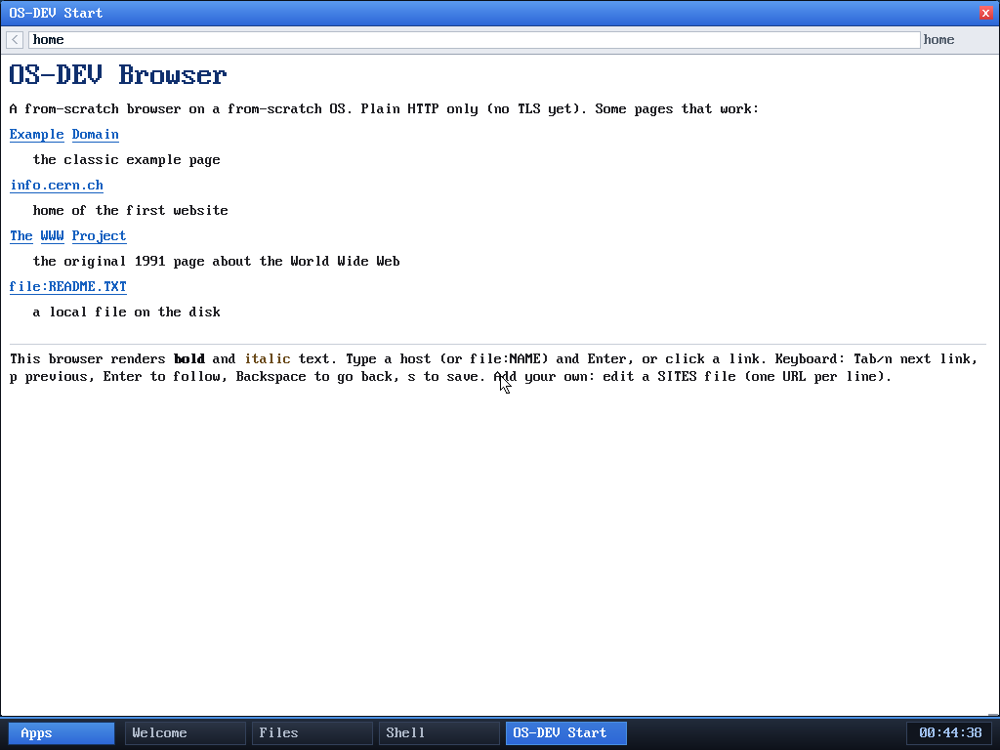

# Milestone 76 — window maximize / restore (F4)

**Goal:** a keyboard maximize toggle for the focused window — the other obvious
WM convenience after focus-switching (M75).

## How it works

`window_t` gained a `maximized` flag and four saved-geometry fields
(`sx,sy,sw,sh`). F4 (scancode `0x3E`) is mapped in `kernel/keyboard.c` to control
code `0x0F`, which the WM intercepts (like F2's `0x0E`) before routing keys to the
focused app. `toggle_maximize(win_count-1)`:

- **maximize:** save the current `x,y,w,h`, then set the window to
  `(0, 0, screen_w, screen_h - TASKBAR_H)` — full screen above the taskbar.
- **restore:** copy the saved geometry back.

No special rendering path is needed: windows already lay out from their `w,h`
(corner-drag resize has existed since M20), so maximizing is just a resize. The
nice side effect is visible in the screenshot — the **browser reflows its text to
the wider width** automatically, because its renderer word-wraps to the window
content area each frame.

## Verified (headless, by screenshot)

1. `browse home` opens the browser at its normal size (~620 px wide), text
   wrapping early.
2. **F4** → the window fills the screen and the help paragraph rewraps across the
   full width; the address bar stretches; the taskbar stays visible.
3. **F4** again → restored to the original size and position, text rewrapped back,
   the other windows visible behind it.

## Why it matters

Combined with F2 (cycle focus), the desktop now has the two core keyboard window
operations. And because maximize is a plain resize, it doubles as a live demo
that window content (notably the browser) adapts to any window size.

## Files
- `kernel/desktop.c` — `maximized`/saved-geometry fields, `toggle_maximize`, F4
  (`0x0F`) intercept in the WM input loop
- `kernel/keyboard.c` — F4 (`0x3E`) → control code `0x0F`
