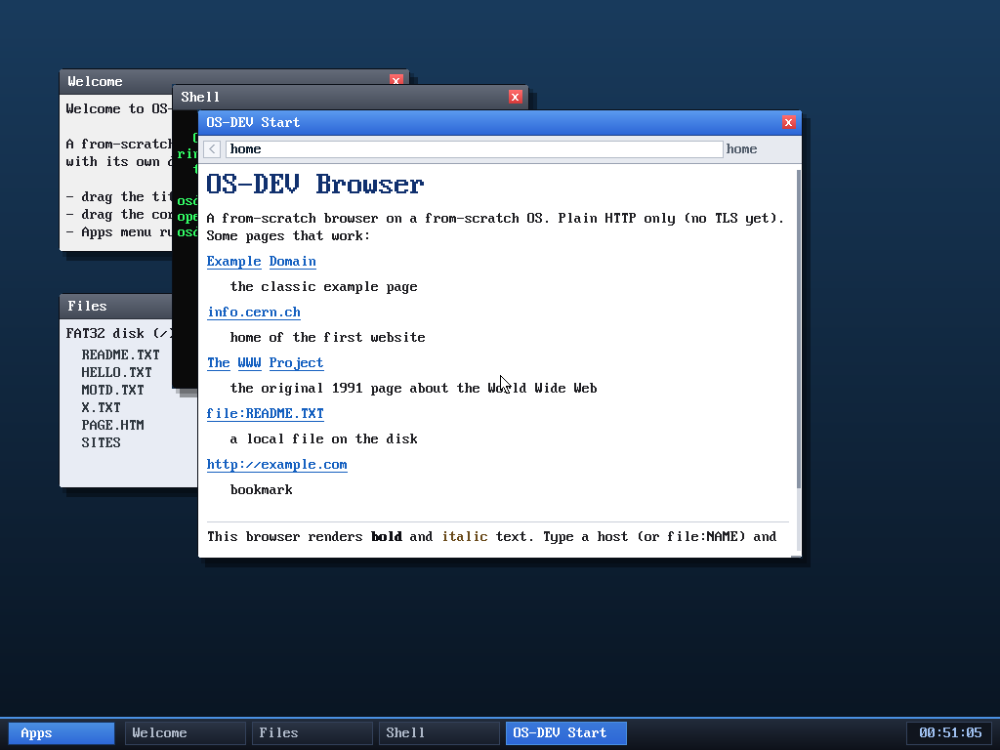

# Milestone 77 — bookmark the current page (`a`) + Back-to-local fix

**Goal:** close the bookmark loop. Milestone 67 made the start page *read* a
`SITES` file and list each line as a bookmark, but the only way to add one was to
hand-edit `SITES`. Now the browser can bookmark the page you're on.

## The feature

Press **`a`** in the browser → `browser_bookmark()` appends the current URL
(`b->cur`) to the `SITES` file on the FAT32 disk:

- Only bookmarkable URLs are saved (`http://`, `https://`, `file:`) — pressing
  `a` on the local "home" page does nothing useful, so it's rejected.
- It reads `SITES`, skips the write if that exact URL is already a line
  (de-dup, → status "already saved"), otherwise appends `<url>\n` and writes back.
- Status line confirms: "bookmarked" / "already saved" / "bookmark failed".

The next time you visit the start page, `build_home` re-reads `SITES` and the new
URL shows up as a clickable bookmark — browser → filesystem → home page, fully
wired.

## The bug it surfaced (and fixed)

Testing the loop (browse → bookmark example.com → Back to home) exposed a
**pre-existing bug in `browser_back`**: it *always* routed the destination
through the network fetch worker. Going Back to a **local** page (`home` or
`file:`) therefore tried to DNS-resolve the literal string "home" — which hangs
on the timeout and then fails, instead of rendering the local page. (It had only
ever been tested going Back between two *network* pages.)

**Fix:** `browser_back` now peeks the destination first. If it's local
(`home`/empty/`file:`), it renders directly via `browser_navigate` (no worker),
while staying race-safe — if a fetch is in flight it bails unchanged, exactly as
the network path does when it loses the fetch claim. Network destinations keep
the original claim-then-pop path.

## Verified (headless, by screenshot)

`browse home` → `n` (select Example Domain) → Enter (load example.com) → `a`
(status "bookmarked", a new `SITES` file appears in the Files window) →
Backspace → the **home page renders instantly** and lists
`http://example.com` under "bookmark". Re-running shows "already saved" (de-dup
works) and Back-to-home still renders correctly.

## Files
- `kernel/browser.c` — `browser_bookmark()` + the `a` key; `browser_back`
  local-destination handling; home-page help text
