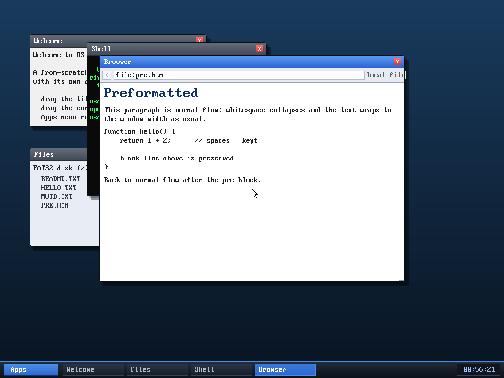

# Milestone 78 — `<pre>` preformatted text + overflow clip

**Goal:** render `<pre>` blocks with their whitespace intact — indentation,
runs of spaces, and blank lines — so code, ASCII art, and plain-text-in-HTML
come through readable instead of collapsed into one wrapped blob.

## The change

The HTML tokenizer normally collapses every run of whitespace and emits one
WORD per token (the renderer puts a single space between words and word-wraps).
That's wrong inside `<pre>`. So `parse_html` gained an `inpre` flag (toggled by
`<pre>`/`</pre>`), and while it's set:

- `\n` ends the current word and emits a line break — and unlike normal flow,
  **consecutive breaks are kept**, so blank lines survive.
- spaces and tabs are **literal**: they accumulate into the word (a whole pre
  line becomes one WORD token, embedded spaces and all), so indentation and
  multiple spaces render exactly.

Because we already use a fixed-width font, preformatted text lines up correctly
with no extra work.

## A robustness fix that came with it

A `<pre>` line can be far wider than the window. The renderer previously drew a
word's full glyph run from its start x even if that ran past the right content
edge — an overflow that could paint over the scrollbar or window border (true for
any over-long word, e.g. a long URL, not just `<pre>`). The draw is now clipped:
`dl = min(len, (cr - cx) / glyph_w)` glyphs, and the link underline / selection
box / click-rect use the clipped width too. Over-long lines are simply cut at the
right edge (we have no horizontal scroll), and nothing draws outside the content
area.

## Verified (headless, by screenshot)

`browse file:pre.htm` (a fixture baked into the disk image) shows the contrast
side by side:

- The normal `
` collapses `whitespace    collapses` to one space and wraps
  across two lines.
- The `<pre>` block keeps `    return 1 + 2;      // spaces   kept` with its
  leading indent and internal spacing, **keeps the blank line**, and lines up
  `function hello() { … }`.
- Normal flow resumes after `</pre>`.

## Files
- `kernel/browser.c` — `inpre` handling in `parse_html`; clip-to-width in the
  render loop
- `tools/mkfatfs.c` — `PRE.HTM` test fixture on the disk
