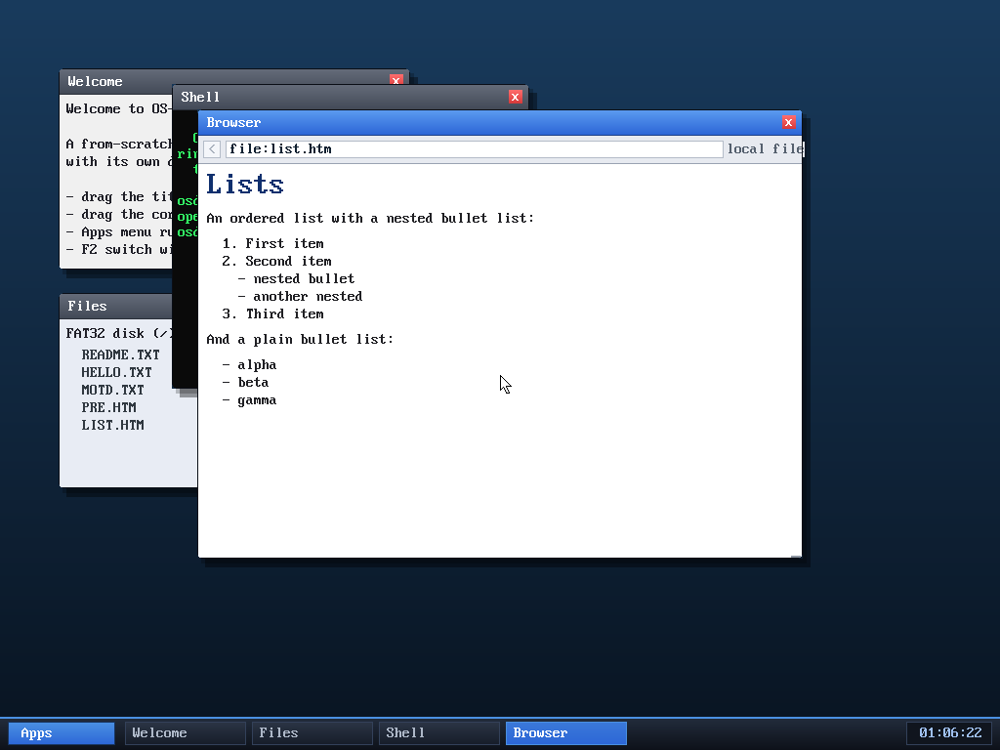

# Milestone 80 — numbered & nested list rendering

**Goal:** render `<ol>`/`<ul>` lists properly — numbered ordered lists and
indented nesting — instead of a flat "-" bullet for every `<li>`.



## What changed

Before, `<li>` always emitted a "-" and `<ul>`/`<ol>` were lumped in with generic
block elements. Now the browser tracks list context (a small stack on the
browser struct):

- `listdepth`, `listtype[8]` (`'u'`/`'o'` per level), `listnum[8]` (the running
  counter for each ordered level).
- `<ul>`/`<ol>` push/pop a level (capped at depth 8) and reset that level's
  counter.
- `<li>` emits a line break, then a marker: **two spaces of indent per nesting
  level**, followed by `N.` for an ordered list (incrementing that level's
  counter) or `-` for a bullet list.

So an `<ol>` numbers 1, 2, 3…, a nested `<ul>` inside it indents further and uses
bullets, and — because each level keeps its own counter — the outer numbering
**resumes correctly** when the nested list ends.

## Verified (headless, by screenshot)

`browse file:list.htm` (a fixture on the disk) renders:

```
1. First item
2. Second item
    - nested bullet
    - another nested
3. Third item          <- ol numbering continued past the nested <ul>

- alpha
- beta
- gamma
```

exactly as intended — numbers, deeper indent for the nested bullets, and the
resumed `3.`.

**Limitation:** wrapping is not hanging-indented — a list item long enough to
wrap continues at the left margin, not under its text. Fine for typical items.

## Files
- `kernel/browser.c` — list-context fields + `<ul>`/`<ol>`/`<li>` handling in
  `handle_tag`; reset in `parse_html`
- `tools/mkfatfs.c` — `LIST.HTM` test fixture
