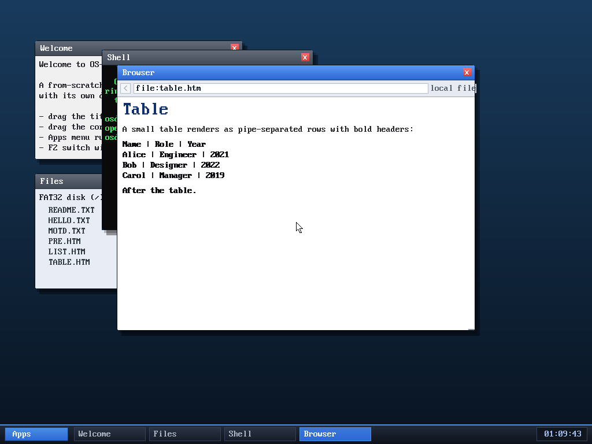

# Milestone 81 — basic table rendering

**Goal:** make `<table>` readable. Previously `<tr>` broke to a new line but
`<td>`/`<th>` did nothing, so a row's cells ran together separated only by a
single space — ambiguous for anything tabular.



## What changed

In `handle_tag`:

- `<tr>` → line break, and reset a per-row cell counter (`b->tdcount`).
- `<td>`/`<th>` → emit a `|` divider before every cell **except the first** in
  the row (tracked by the counter), so a row reads `cell1 | cell2 | cell3`.
- `<th>` additionally renders **bold** (header cells), reset on `</th>`.
- `<table>` → a paragraph break before and after, and reset the counter.

This is intentionally a *flow* rendering, not a true grid — there's no
column-width pass, so cells aren't vertically aligned. But the pipe separators
and bold headers make tables clearly legible, which is the goal for a no-frills
HTTP browser.

## Verified (headless, by screenshot)

`browse file:table.htm` (a fixture on the disk) renders:

```
Name | Role | Year        (bold header row)
Alice | Engineer | 2021
Bob | Designer | 2022
Carol | Manager | 2019
```

with "After the table." resuming normal flow — each row on its own line, cells
divided, header bold.

**Limitation:** no column alignment (variable cell widths don't line up), and no
`rowspan`/`colspan`. Good enough to read tabular content.

## Files
- `kernel/browser.c` — `<tr>`/`<td>`/`<th>`/`<table>` handling + `tdcount`
  field (reset in `parse_html`)
- `tools/mkfatfs.c` — `TABLE.HTM` test fixture
