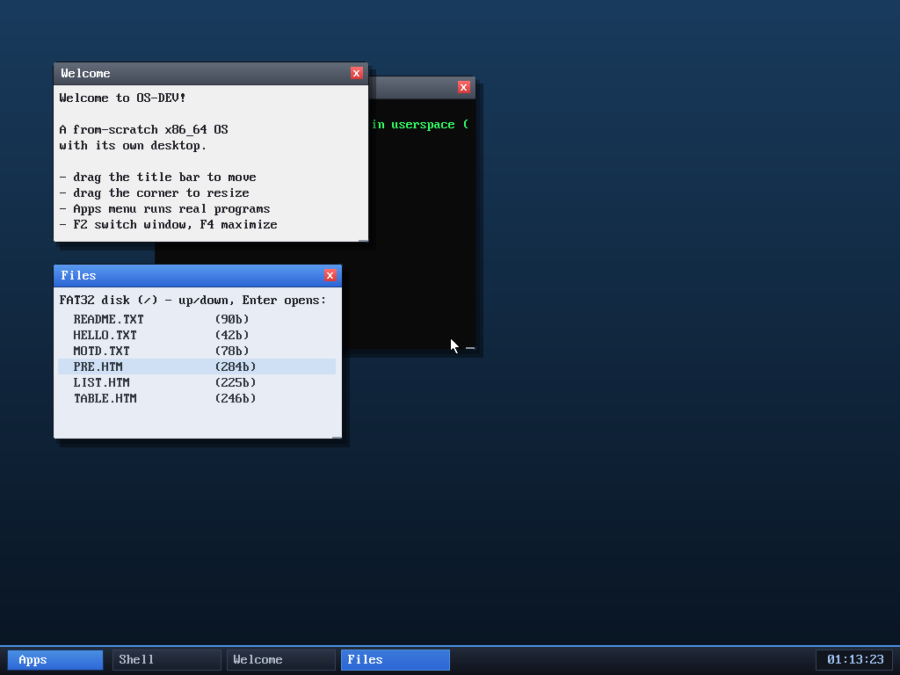

# Milestone 82 — interactive Files window (keyboard file browser)

**Goal:** turn the read-only Files window into a usable, keyboard-driven file
browser that opens files — tying the desktop, filesystem, and web browser
together.

## What changed

The Files window already listed the FAT32 root each frame. Now it has a
selection and responds to keys when focused:

- `window_t` gained an `fsel` field (the highlighted row).
- The draw highlights row `fsel` with a light-blue bar and the header reads
  "up/down, Enter opens:".
- The WM input loop routes keys to a new `files_key()` for a focused
  `KIND_FILES` window: **up/down** move the selection (clamped to the file
  count), **Enter** opens the highlighted file in a new browser window as
  `file:NAME` (directories — names ending in `/` — are skipped).

Since the browser already renders both HTML (`parse_html`) and plain text
(`parse_text`) for `file:` URLs, opening *any* file Just Works: `.htm` files
render as pages, `.txt` files as text.

## Verified (headless, by screenshot)

- Boot, **F2 ×2** to focus the Files window (its chip highlights, header shows
  the hint).
- **Down ×3** moves the highlight from `README.TXT` to `PRE.HTM`.
- **Enter** opens a browser window at `file:PRE.HTM`, rendering the preformatted
  page.

A complete chain — keyboard window focus (M75) → file selection → open in the
browser — with no mouse, fully scriptable.

## Why it matters

This is the first window besides the shell/browser that takes keyboard input, and
it makes the desktop feel integrated: the file list isn't just a readout, it's a
launcher. It also leans on the keyboard-everywhere theme so the whole flow is
testable headlessly.

## Files
- `kernel/desktop.c` — `fsel` field, Files highlight, `files_key()`, and
  `KIND_FILES` key routing in the WM loop
