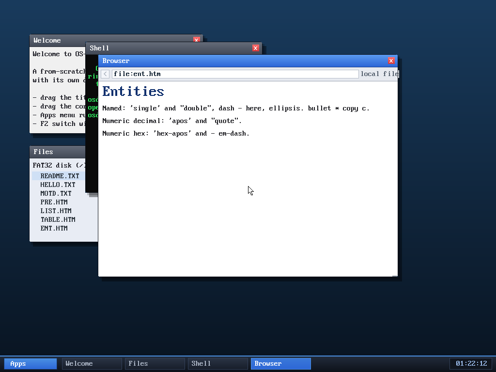

# Milestone 84 — HTML entity decoding (hex, typographic) + a real bug fix

**Goal:** decode the HTML entities that pepper real pages — hex numeric refs and
the typographic punctuation (curly quotes, dashes, ellipsis) — so text reads
cleanly instead of showing raw `&rsquo;` / `&#x2014;` garbage.



## What was added

- **Hex numeric entities** `&#xHH;` (e.g. `&#x27;` → `'`). Previously only
  decimal `&#NN;` was parsed; a hex ref returned undecoded.
- **A Unicode→ASCII fold** (`uni_to_ascii`) so codepoints with no glyph in our
  ASCII font become sensible lookalikes: curly quotes `’ “ ”` → `' "`, en/em
  dash → `-`, ellipsis `…` → `.`, bullet `•` → `*`, nbsp → space, `©` → `c`.
  This drives both numeric forms (`&#8217;` and `&#x2019;` alike).
- **Named typographic entities**: `&lsquo; &rsquo; &ldquo; &rdquo; &hellip;
  &bull; &middot; &copy;` (joining the existing `&amp; &lt; &gt; &quot; &apos;
  &nbsp; &mdash; &ndash;`).

## The bug it uncovered

Testing the named entities revealed they had **never** decoded in normal text —
including the original `&amp;`/`&lt;`/`&gt;`. The matcher used `tageq`, which
requires *full-string* equality of both arguments; but `decode_entity` is handed
a pointer into the middle of the page, so the string continues past the entity
(`"&lt;b>…"`). `tageq` therefore only matched when an entity sat at the very end
of the buffer. It went unnoticed because the test pages happened not to use
named entities in visible text.

**Fix:** a length-bounded matcher `ent_is(s, len, lit)` that compares exactly the
entity's `len` characters and requires `lit` to be that long. All named entities
now decode mid-text — repairing `&amp;`/`&lt;`/`&gt;` too.

## Verified (headless, by screenshot)

`browse file:ent.htm` renders:

```
Named: 'single' and "double", dash - here, ellipsis. bullet * copy c.
Numeric decimal: 'apos' and "quote".
Numeric hex: 'hex-apos' and - em-dash.
```

— named, decimal, and hex entities all folded correctly.

## Files
- `kernel/browser.c` — `ent_is`, `uni_to_ascii`, hex numeric parsing, the new
  named entities
- `tools/mkfatfs.c` — `ENT.HTM` test fixture
