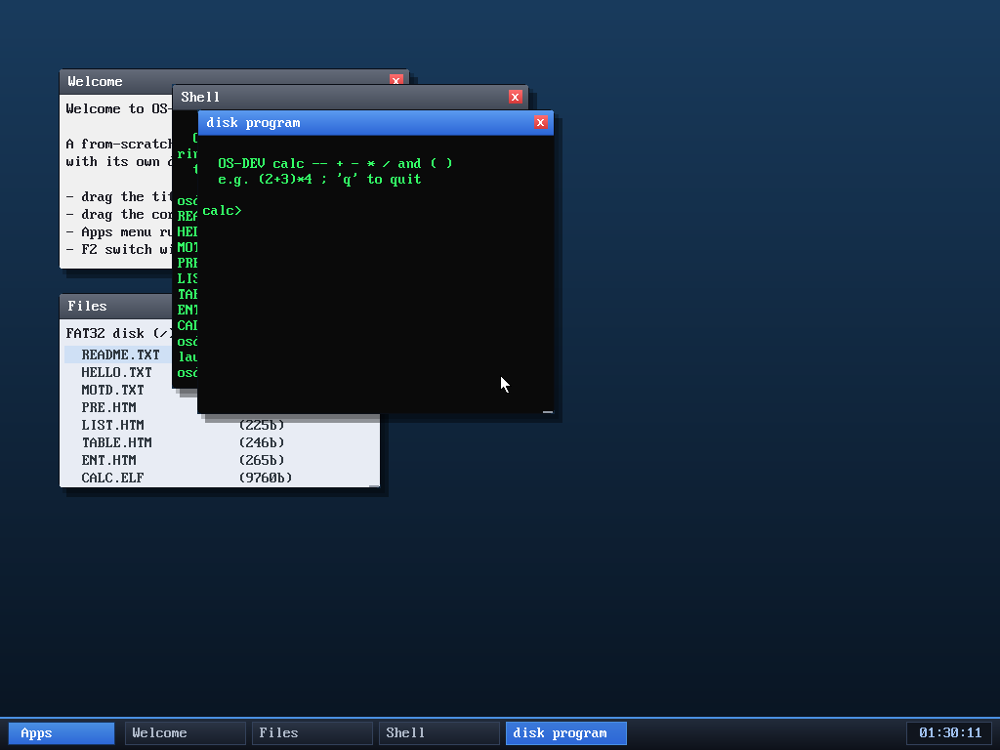

# Milestone 85 — running an ELF program from disk

**Goal:** load and execute a program from the **filesystem**, not just the ELFs
baked into the kernel image. `run calc.elf` reads `CALC.ELF` off the FAT32 disk
and launches it as a ring-3 process.



## How it works

The ELF machinery was already general: `app_spawn(const void *elf, title)` calls
`elf_load(elf)` to copy an in-memory ELF's segments into a new address space.
Until now the only callers passed pointers into the embedded blob
(`user_blob.asm`). Loading from disk is just sourcing those bytes from a file:

```c
int app_spawn_from_file(const char *path) {
    uint8_t *buf = kmalloc(64 * 1024);
    long n = vfs_read(path, buf, 64 * 1024);
    int rc = (n > 0 && app_spawn(buf, "disk program")) ? 0 : -1;
    kfree(buf);                 /* elf_load copied the segments synchronously */
    return rc;
}
```

This is safe because `app_spawn` switches to the new address space (interrupts
off) and `elf_load` copies all segments *during the call* — and the `kmalloc`
buffer lives in the kernel heap, which is mapped into every address space, so it
stays readable across the CR3 switch. The buffer is freed as soon as `app_spawn`
returns.

`SYS_spawn` now tries the built-in registry first, then falls back to a disk
load, so `run <name>` works for both:

```c
int rc = app_spawn_named(nm);              /* built-in? (shell, calc, snake…) */
if (rc < 0) rc = app_spawn_from_file(nm);  /* else load it from the FAT32 disk */
```

## Multi-cluster files in the image builder

The host image builder `mkfatfs` previously wrote each file as a single 512-byte
cluster — fine for the tiny text fixtures, useless for a ~10 KB ELF. It now
**chains clusters**: each file is laid out across `ceil(len / 512)` clusters with
a proper FAT chain, and it can embed a **host binary** (reads `build/calc.elf`
into the image as `CALC.ELF`). It skips a missing host file with a warning so the
build never breaks.

## Verified (headless, by screenshot)

- `ls` shows `CALC.ELF 9760` — the 20-cluster file reads back at *exactly* the
  host ELF's size, proving the multi-cluster chain (writer + the kernel's FAT
  reader) is correct.
- `run calc.elf` opens a window (titled "disk program") running the calculator —
  the same program, but loaded from the filesystem instead of the kernel blob.

## Hardening the loader

`elf_load` previously trusted its input completely — fine when the only source
was the in-kernel blob, but a disk file could be truncated, corrupt, or crafted.
It now validates against the image size (`maxsz`, threaded through `app_spawn`):

- the program-header table (`e_phoff + e_phnum·e_phentsize`) must lie within the
  image, and `e_phentsize` must be sane;
- each `PT_LOAD`'s `p_offset + p_filesz` must be within the image, and
  `p_memsz ≥ p_filesz`;
- each segment's `p_vaddr`/`p_memsz` must sit in the low user range
  (`[0x1000, 0x50000000)` — below the user stack), which rejects any segment
  aimed at kernel/higher-half memory and catches integer overflow.

The trusted embedded path passes `maxsz = ~0` (no file-bound check) but still
gets the vaddr validation. Our programs link at `0x40000000` with tiny segments,
so they pass; a bogus ELF returns 0 and `app_spawn` cleanly refuses to start it.

## Why it matters

This is the first program executed from outside the kernel image — the basis for
a system that loads arbitrary programs from disk rather than embedding them. The
foundation (per-process address spaces, the ELF loader, FAT32 read) was all
there; this milestone connects them, and hardens the loader now that its input
is no longer fully trusted.

The window title shows the **filename** (e.g. `calc.elf`): `app_spawn` copies the
title into a per-app buffer before the CR3 switch, so a filename from another
address space safely outlives the call.

**Limitations:** programs must be ≤ 64 KB and link at the standard user base
address (which our build already does).

## Files
- `kernel/app.c` — `app_spawn_from_file`
- `kernel/syscall.c` — `SYS_spawn` disk fallback
- `kernel/include/app.h`, `user/shell.c` — declaration + `run` help text
- `tools/mkfatfs.c` — multi-cluster file layout + host-binary embedding (`CALC.ELF`)
