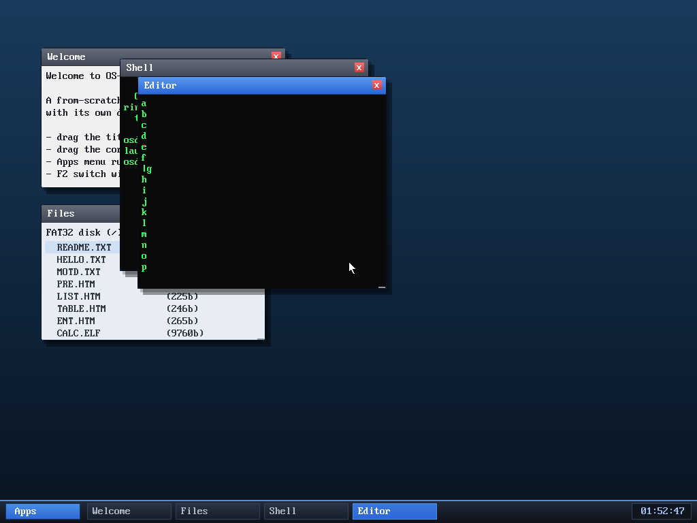

# Milestone 87 — editor keeps the cursor visible

**Goal:** fix the text editor's long-file behaviour. It rendered the *entire*
document every frame, so in a file taller than the window the grid scrolled and
the cursor scrolled off the top — you couldn't see what you were editing.

## The fix

The editor now renders a **window of the document around the cursor** instead of
the whole thing. Two small wrap-aware helpers (the app grid wraps at 44 columns):

- `row_of(pos)` — the grid row a document offset lands on (counting `\n` and
  44-column wraps).
- `row_offset(target)` — the document offset where a given grid row begins.

`render` computes the cursor's row, picks a start row that centres the cursor
(`crow - EDVIS/2`, clamped to 0), and prints **exactly `EDVIS` (16) grid rows**
from there — so the grid never scrolls the cursor back off, and the cursor stays
on screen with context above and below.

## Verified (headless, by screenshot)

Opened the editor on a fresh file, typed 26 lines (`a`…`z`), then pressed **Up
20 times**. The view scrolls with the cursor: it now shows lines `a`–`p` with the
`|` cursor sitting at line `g` — visible, mid-screen. Before the fix the view
stayed pinned to the bottom (`t`–`z`) and the cursor at `g` was off-screen.

## Files
- `user/editor.c` — `row_of`/`row_offset` helpers and the windowed `render`
