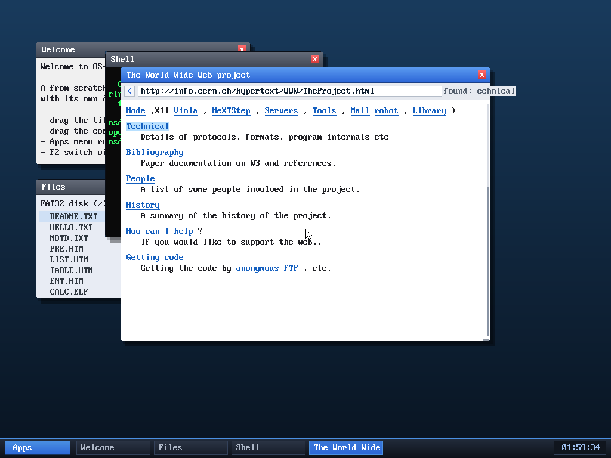

# Milestone 88 — in-page find

**Goal:** search for text within the current page — type a query, jump to the
match, and have it highlighted, scrolling it into view on long pages.

## How it works

Press **`\`** to enter find mode; the status line shows `find: <query>` as you
type (Backspace edits, Esc cancels). **Enter** searches for the next word token
whose text contains the query (case-insensitive), wrapping around; pressing
Enter again jumps to the following match.

- `tok_matches` — case-insensitive substring test against a token's text.
- `do_find(start)` — scans word tokens from `start`, wrapping; on a hit it sets
  `find_tok`, scrolls the match near the top, and shows `found: <query>` (or
  `not found`).
- The render loop records **every token's content-space y** in a `toky[]` array
  (the same idea as `linky[]` for links), so `do_find` can scroll any match into
  view immediately. The matched token is drawn with a light-blue highlight.

`find_tok` is cleared whenever a new page is parsed.

## Verified (headless, by screenshot)

- **Short page:** on the start page, `\` then `find` highlights the word "find"
  in the help text and the status reads `found: find`.
- **Long page (scroll-to):** on cern's *World Wide Web project* page (taller than
  the window), `\` then `Technical` **scrolls the page down** to the "Technical"
  section and highlights the word — confirming the per-token `toky[]` positions
  drive a correct scroll-into-view.

## Files
- `kernel/browser.c` — `finding`/`findq`/`find_tok`/`toky[]` state, `tok_matches`,
  `do_find`, find-mode key handling (`\`, type, Enter, Esc), render highlight +
  per-token y recording; home-page help text
