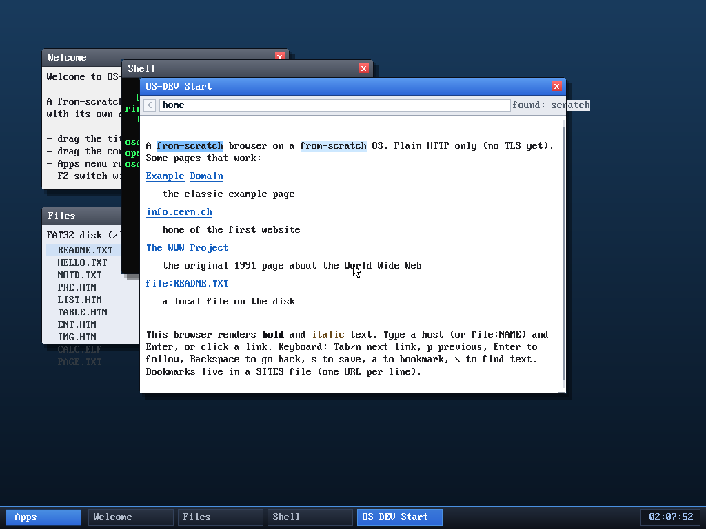

# Milestone 90 — find: highlight all matches + prev/next

**Goal:** finish the in-page find (milestone 88) into a proper find: show **every**
match, mark the current one, and step between them.

## What changed

- **All matches highlighted.** While a find is active (`find_tok >= 0`), the
  render loop highlights *every* word token that matches the query in light blue,
  and draws the **current** match in a stronger blue — so you see all occurrences
  at a glance and which one you're on.
- **Prev/next.** `do_find` gained a direction parameter. In find mode:
  - **Enter** or **Down** → next match,
  - **Up** → previous match,

  both wrapping around. (Typing still edits the query; Esc exits; Backspace
  edits.) Each step scrolls the new current match into view.

## Verified (headless, by screenshot)

On the start page, `\` then `scratch` highlights both occurrences of
"from-scratch" (the word "scratch" is a substring of each token) — the first in
strong blue (current), the second in light blue. Pressing **Down** moves the
strong highlight to the second occurrence and dims the first, confirming
prev/next stepping and the all-match highlight together.

## Files
- `kernel/browser.c` — `do_find(start, dir)`, find-mode Up/Down handling, and the
  render highlight of all matches with the current one emphasised
