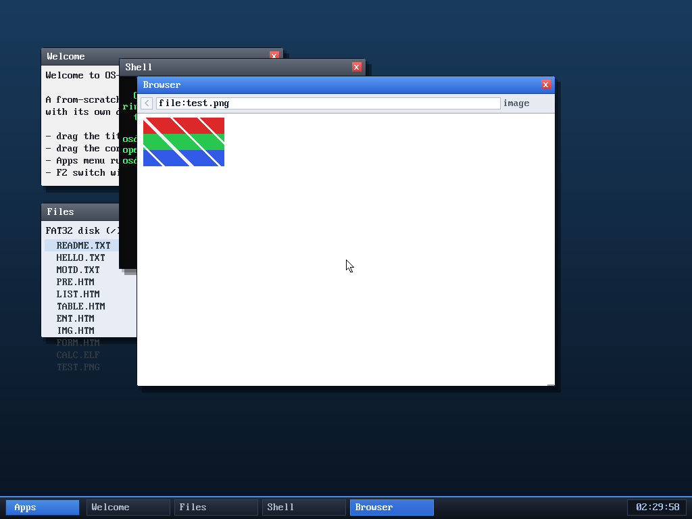

# Milestone 92 — PNG image rendering

**Goal:** show **actual images**, not just their alt text. The browser now
decodes PNG files from scratch and blits them to the screen.

## Two new from-scratch components (host unit-tested)

**`kernel/inflate.c` — a DEFLATE decompressor (RFC 1951).** The algorithm behind
zlib/PNG: an LSB-first bit reader, canonical Huffman decoding (counts + sorted
symbols), and LZ77 back-references. Handles all three block types — stored,
fixed-Huffman, and dynamic-Huffman. **Verified on the host** against `zlib`'s raw
output across stored/fixed/dynamic blocks, long runs, and binary data, under
`-fsanitize=address,undefined` — all pass.

**`kernel/png.c` — a PNG decoder (RFC 2083).** Reads IHDR, concatenates the IDAT
chunks, inflates them (skipping the 2-byte zlib header), reverses the
per-scanline filters (None/Sub/Up/Average/Paeth), and expands every pixel to
RGBA. Supports 8-bit grayscale / RGB / gray-alpha / RGBA, non-interlaced.
**Host-tested** against PNGs encoded with all five filter types — pixels match
exactly.

Both take caller-provided buffers (no allocation inside), so they're standalone
and testable.

## Browser integration

When a `file:` or `http:` resource begins with the PNG signature, the browser
decodes it instead of parsing HTML: it peeks the IHDR dimensions, allocates an
RGBA buffer and a scratch buffer sized to the image, decodes, and stores the
result. The render path blits the RGBA **scaled to fit the window width**
(nearest-neighbour), alpha-blended over white, and scrolls if it's taller than
the view. Loading any normal page frees the image.

## Verified (headless, by screenshot)

`browse file:test.png` (a 120×72 RGB fixture on the disk) renders the image
correctly: the red / green / blue horizontal bands and the diagonal white
stripes appear exactly as encoded — confirming the inflate, the scanline
unfiltering, and the framebuffer blit are all correct. No panics.

## Hardening (review #13)

A review subagent caught a **critical** bug before this shipped: `png_decode`
checked `width/height > 0` but had **no upper bound**, so a crafted IHDR with
huge dimensions overflowed the 64-bit `(stride+1)*height` / `width*height*4`
size math, wrapping past the `scratch_cap`/`out_cap` checks and causing
out-of-bounds writes that corrupt the kernel. It bypassed `try_image`'s 2048
clamp because that reads dimensions from fixed file offsets while `png_decode`
reads IHDR from anywhere in the chunk stream — reachable from any `file:`/`http:`
image. **Fixed** by bounding `width`/`height ≤ 32768` *inside* `png_decode`, so
the size math can't overflow and the buffer caps hold. Verified: a crafted
huge-dimension PNG is now rejected (no OOB, clean under ASan/UBSan) while valid
PNGs still decode.

**Limitations:** the source image must fit the browser's fetch buffer (≤ 128 KB
compressed after milestone 94); no interlacing; inline `` still shows
alt text (only a directly-navigated image URL is rendered). (Palette PNGs —
colour type 3 — were added in milestone 95.)

## Files
- `kernel/inflate.c` + `inflate.h` — DEFLATE decompressor
- `kernel/png.c` + `png.h` — PNG decoder
- `kernel/browser.c` — `try_image`/`drop_image`, image detection in the
  file:/http: load paths, and the scaled RGBA blit in the render loop
- `tools/mkfatfs.c`, `tools/test.png` — the `TEST.PNG` fixture
