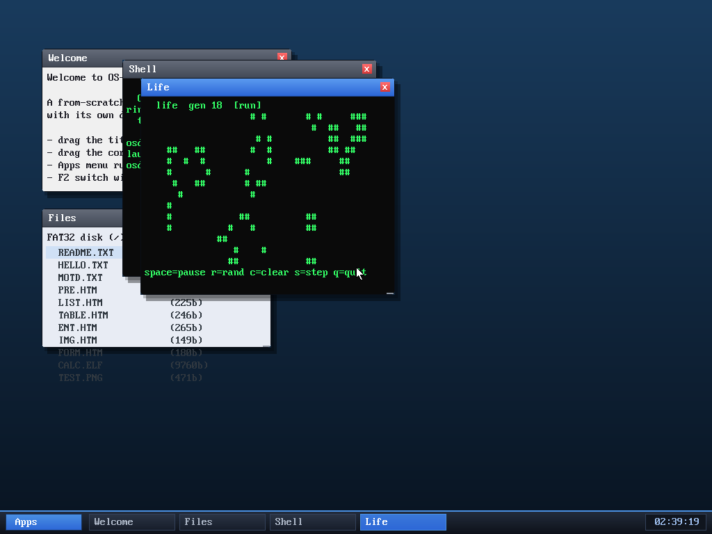

# Milestone 93 — Conway's Game of Life

**Goal:** a seventh userspace program — Conway's Game of Life — for some variety,
and to exercise the autonomous-app loop once more.

## What it is

`user/life.c` runs the classic cellular automaton on a 40×14 toroidal grid: each
generation, a live cell survives with 2–3 live neighbours and a dead cell with
exactly 3 neighbours is born (neighbours wrap around the edges). It uses the same
non-blocking pattern as the other games — `sys_pollkey` + `sys_sleep` — so it
evolves on its own, ~150 ms per generation.

Keys: **space** pause/resume, **r** re-randomise, **c** clear, **s** single-step
(while paused), **q**/Esc quit.

Wiring a new program is still the same four small edits: `user/life.c` →
`Makefile` `USER_ELFS` → `user_blob.asm` (incbin) → the `progs[]` registry in
`app.c` → the Apps menu in `desktop.c`.

## Verified (headless, by screenshot)

`run life` (or Apps → Life) opens a window seeded with a random board; after ~3 s
it shows **generation 18** with live cells in the characteristic clusters and
still-lifes of Life, confirming the step/render/sleep loop runs autonomously. No
panics.

## Files
- `user/life.c` — the program
- `Makefile`, `kernel/asm/user_blob.asm`, `kernel/app.c`, `kernel/desktop.c` —
  the four registration points
