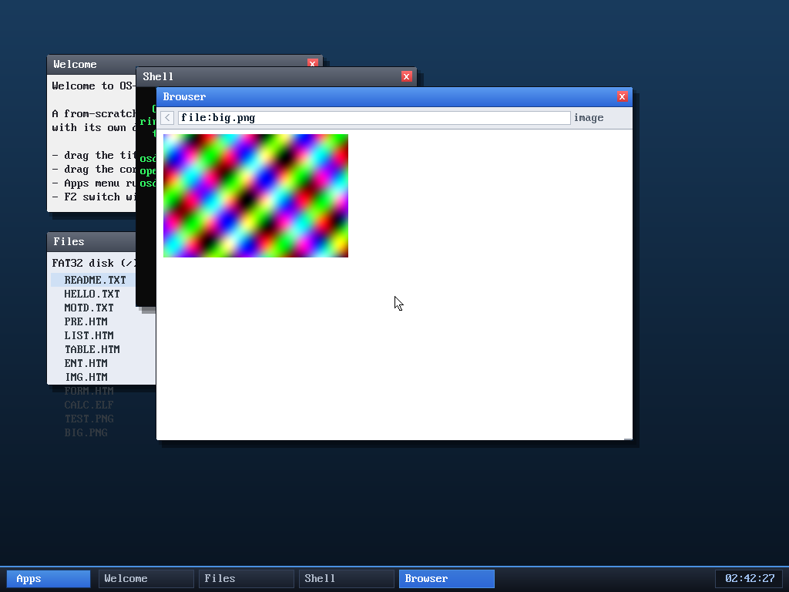

# Milestone 94 — bigger fetch/render buffers (real-sized images)

**Goal:** the browser's response buffer was 32 KB, so most real images and pages
were truncated. Bumping the buffers lets the browser load real-sized content.

## What changed

Three browser size constants:

| constant | before | after | what it caps |
|----------|--------|-------|--------------|
| `RAW_MAX`  | 32 KB | **128 KB** | the HTTP response / file-read / image-source buffer |
| `TEXT_MAX` | 24 KB | **48 KB** | the token text pool (kept < 64 KB — token offsets are `uint16`) |
| `TOK_MAX`  | 4000  | **7000**   | max tokens per page |

The bigger `RAW_MAX` is the headline: a PNG can now be up to ~128 KB compressed
instead of ~32 KB, so actual images (not just tiny icons) load. The `TEXT_MAX`/
`TOK_MAX` bumps let longer pages render more of their text before hitting the
caps. Per-browser memory grows accordingly (~128 KB raw + ~56 KB tokens + a
28 KB position array), which is negligible on a 255 MiB machine.

## Verified (headless, by screenshot)

- **`file:big.png`** — a **113 KB** plasma image (240×160) decodes and renders
  correctly. This is larger than the old 32 KB buffer, so it simply couldn't
  have loaded before; now it does, pixel-accurate, with no panics.
- **Regression:** the HTML start page still renders correctly (headings, links,
  bookmarks, help text) after the `TEXT_MAX`/`TOK_MAX` change.

## Files
- `kernel/browser.c` — `RAW_MAX` / `TEXT_MAX` / `TOK_MAX`
- `tools/mkfatfs.c`, `tools/big.png` — the 113 KB `BIG.PNG` fixture
