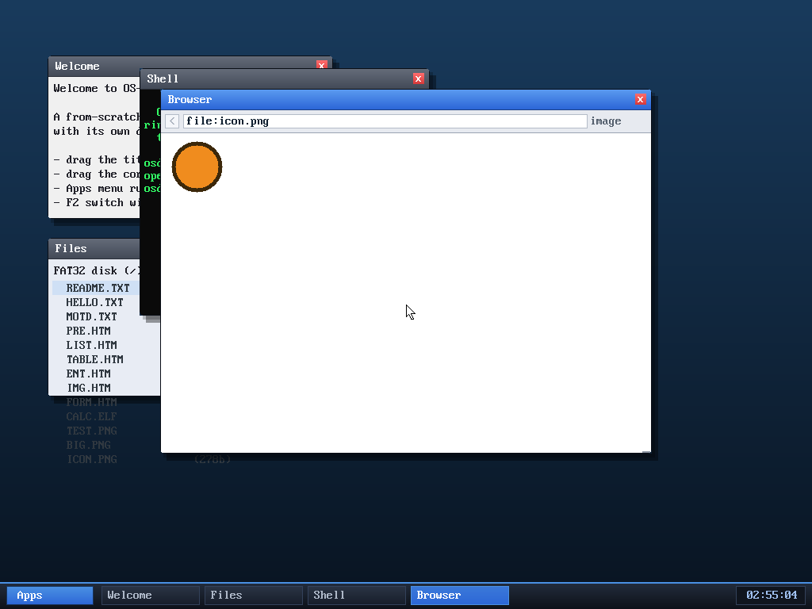

# Milestone 95 — PNG palette (colour type 3)

**Goal:** decode palette PNGs. Colour type 3 (a `PLTE` palette + 1-byte indices)
is one of the most common PNG encodings — icons and web graphics use it because
it's compact — and the decoder previously rejected it.

## What changed

A small addition to `kernel/png.c`:

- accept colour type 3 in the IHDR validation;
- capture the `PLTE` chunk (up to 256 RGB triples) during the first pass;
- treat the pixel data as 1 byte/pixel (a palette index);
- in the RGBA expansion, look the index up in the palette (clamped to the
  palette size);
- capture the `tRNS` chunk (per-index alpha) so **transparent palette PNGs**
  (very common for icons) render with their transparency — alpha-blended over
  the white page background. Indices past the `tRNS` array are opaque.

A palette image without a `PLTE` chunk is rejected.

## Verified

- **Host unit test:** a 6×2 colour-type-3 PNG with a 4-colour palette decodes to
  exactly the expected RGB pixels (under `-fsanitize=address,undefined`); a
  palette PNG with a `tRNS` chunk yields the expected per-index alpha
  (0/128/255/255); the grayscale/RGB/RGBA cases still pass.
- **In-kernel:** the demo `TEST.PNG` was re-encoded as a palette PNG (it uses
  only 4 colours, so it shrank from 471 → 253 bytes) and `browse file:test.png`
  renders it **identically** to the truecolour version — the red/green/blue
  bands and diagonal white stripes — confirming the in-kernel palette path
  (`PLTE` lookup → RGBA → blit) is correct. No panics.

- **In-kernel transparency:** a `file:icon.png` fixture — an orange disc on a
  *transparent* background whose palette colour is **black** — renders with a
  **white** background (the page colour), not black. That proves the transparent
  pixels were alpha-blended over the page rather than drawn as palette-black, so
  tRNS works end-to-end in the kernel. No panics.

The decoder now covers PNG colour types 0 (gray), 2 (RGB), 3 (palette), 4
(gray+alpha) and 6 (RGBA), 8-bit, non-interlaced. A review subagent (the third
clean one in a row) verified the palette/tRNS bounds and adversarial edge cases.
`tRNS` is now applied for **all** colour types: per-index alpha for palette, and
the transparent-colour key for grayscale (a gray value) and RGB (an R,G,B triple)
— each host-verified (e.g. a grayscale PNG keyed on value 128 yields alpha
255,255,**0**,255,255).

## Files
- `kernel/png.c` — `PLTE` capture + colour-type-3 expansion
- `tools/test.png` — re-encoded as a palette PNG (the in-kernel test)
