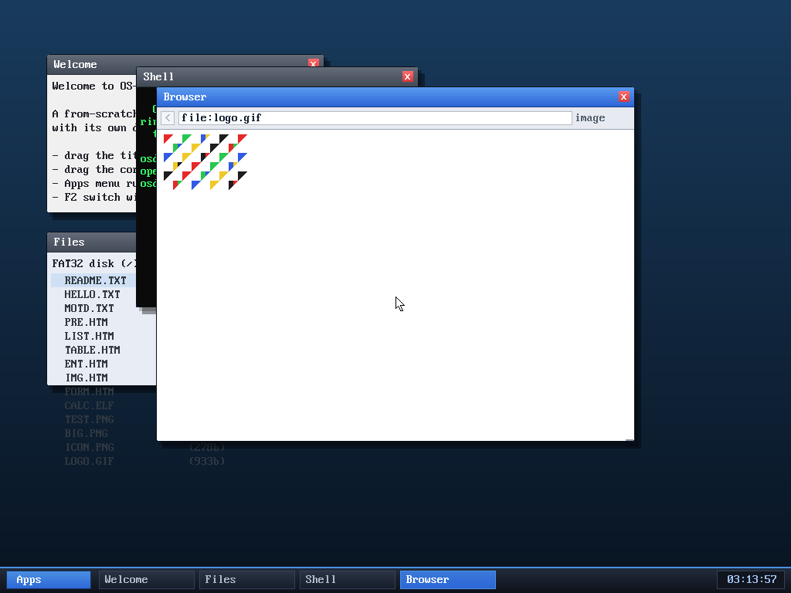

# Milestone 97 — GIF image rendering

**Goal:** decode the other ubiquitous web image format — GIF — so the browser
renders it alongside PNG.

## A from-scratch GIF decoder (host unit-tested)

`kernel/gif.c` decodes the first frame of a GIF87a/89a:

- **LZW decompression** — GIF's variable-width LZW over its chain of
  length-prefixed sub-blocks: the clear/end codes, the growing dictionary
  (decoded with the classic prefix/suffix/stack walk), the self-referential
  *KwKwK* case, and the code-width increments. Every table index and output
  write is bounded (the input is untrusted).
- **Structure** — logical screen descriptor, global/local colour tables, the
  Graphic Control Extension (for a transparent index), and the image descriptor;
  other extensions are skipped.
- **De-interlacing** — decoded rows are placed into GIF's 4 interlace passes.
- Expands palette indices to **RGBA**, honouring the transparent index.

**Verified on the host against Pillow** (the reference decoder), pixel-for-pixel,
across: a 64-colour gradient (exercises dictionary growth + code-width
transitions), a few-colour blocky image, a **transparent** GIF, an **interlaced**
GIF, and a larger 160×120/200-colour image — all match, under
`-fsanitize=address,undefined`.

## Browser integration

`try_image` now detects the format by signature — PNG (`\x89PNG`) or GIF
(`GIF8`) — and dispatches to the matching decoder; both produce RGBA that the
existing scaled framebuffer blit displays. GIF needs only a one-index-per-pixel
scratch buffer (the LZW work tables are static).

## Verified (headless, by screenshot)

`browse file:logo.gif` (a transparent, **interlaced** GIF fixture on the disk)
renders correctly: the coloured-triangle pattern in the right colours, the
transparent background showing as the white page, decoded from interlaced LZW
data — confirming the whole chain in-kernel. No panics.

## Hardened against malformed input

Because a GIF can be hostile, the decoder bounds every colour-table read, LZW
table index, and output write, and rejects bad dimensions/sizes. Verified two
ways: an **ASan/UBSan fuzz** of ~130,000 malformed inputs (every truncation of
the valid GIFs, random byte mutations, and `GIF8`-prefixed garbage) produced
**zero out-of-bounds** — every case either decoded or was cleanly rejected; and
a self-audit caught one real bug before review (the Graphic Control Extension
read `data[p+4]` while only guarding `p+1 < len` — a 1-byte over-read on a
truncated GCE — now guarded `p+4 < len`). The PNG decoder was fuzzed the same way
(~234,000 inputs, zero OOB).

A review subagent (the 15th) then examined the decoder for adversarial inputs and
found **no exploitable out-of-bounds** — and specifically confirmed it does *not*
repeat PNG's earlier dimension-overflow bug (the dimension/cap math uses `long`
casts correctly). Its two defense-in-depth suggestions (avoid `p + size*3`
int-overflow in the table-size guards by comparing `size*3 > len - p`; reject
negative caps) were applied.

## Files
- `kernel/gif.c` + `gif.h` — the GIF/LZW decoder
- `kernel/browser.c` — `try_image` PNG/GIF format dispatch
- `tools/mkfatfs.c`, `tools/logo.gif` — the `LOGO.GIF` fixture
