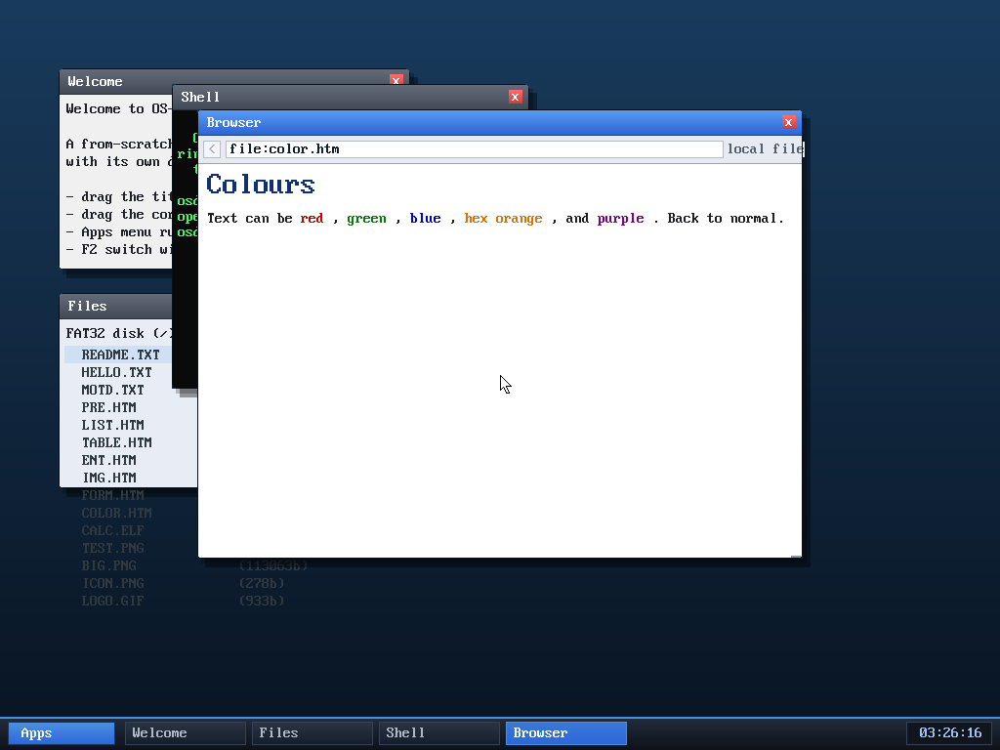

# Milestone 98 — text colour (``)

**Goal:** render coloured text. Pages (especially older ones) set text colour
with ``; the browser now honours it, with both named colours and
`#hex`.

## How it works

- A `parse_color()` helper maps an HTML colour to RGB: `#rgb`/`#rrggbb` hex, or
  one of ~19 named colours (red, green, blue, orange, purple, teal, …).
- The browser tracks a *current colour* (`b->curcolor`, 0 = none) set by
  `` and cleared by ``. `emit_word` stamps it onto each word
  it produces, in a parallel `tokcolor[]` array (so `tok_t` is unchanged — no
  token-literal churn).
- The render overrides a word's colour with `tokcolor[t]` when set, except for
  links (which keep their link colour). A sentinel bit distinguishes "colour
  set to black" from "no colour".

(Nested `` isn't stacked — a `` resets to the default rather than a
parent colour — which is fine for typical pages.)

## Verified (headless, by screenshot)

`browse file:color.htm` renders *red*, *green*, *blue*, *hex orange* (from
`#E07000`), and *purple* each in the correct colour, with the surrounding text in
the default — confirming both named and hex colours, and that the colour resets
after ``. No panics.

## Files
- `kernel/browser.c` — `parse_color`/`hexd`, `curcolor`/`tokcolor[]`, the
  `` handler, and the render colour override
- `tools/mkfatfs.c` — `COLOR.HTM` test fixture
