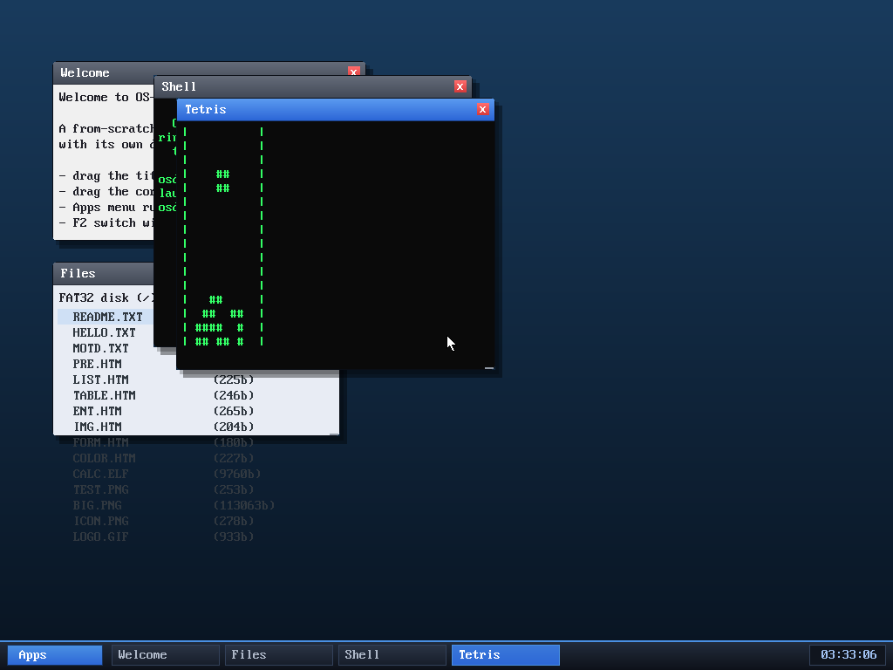

# Milestone 99 — Tetris (and milestone 100!)

**Goal:** an eighth userspace program — Tetris — which also makes OS-DEV's
**100th milestone** (docs 00–99).

## What it is

`user/tetris.c` is a real Tetris on a 10×16 well (sized to the window's text
grid): the seven tetrominoes are 4×4 **bit-masks rotated at runtime** (a 90°
rotate of the mask), a gravity tick drops the active piece, landing **locks** it
into the board, **full rows clear** (scoring more for multi-line clears), and a
new piece spawns — game over if the spawn collides.

Controls (non-blocking, like the other games): **←/→** move, **↑** rotate,
**↓** soft-drop, **space** hard-drop, **q** quit; any key restarts after a game
over.

## Verified (headless, by screenshot)

`run tetris` (or Apps → Tetris): pieces spawn and fall; left/right/rotate respond;
**space** hard-drops; and dropped pieces **stack and lock** at the bottom of the
well (visible in the screenshot) — confirming gravity, collision, locking, and
rendering. No panics.

## The 100-milestone mark

This is the 100th learning doc. OS-DEV now goes from power-on to a themed
desktop hosting **eight ring-3 programs** (a shell, a clock, a calculator, a text
editor, and four games — Snake, 2048, Life, Tetris), a system monitor, an
interactive file manager, and a **keyboard-driven web browser that renders real
PNG and GIF images and colour text** over a from-scratch TCP/HTTP stack — and it
runs programs loaded from its own FAT32 disk. From a bare Multiboot entry point.

## Files
- `user/tetris.c` — the game
- `Makefile`, `kernel/asm/user_blob.asm`, `kernel/app.c`, `kernel/desktop.c` —
  the four registration points
